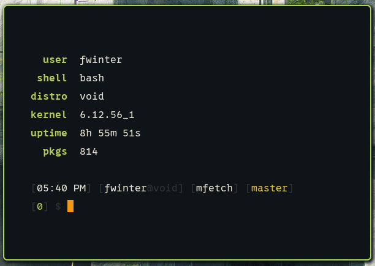
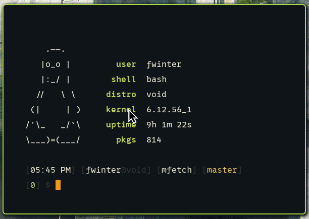

# mfetch - Minimal Info Fetcher

`mfetch` is just another information fetcher, yet blazingly fast, made with love in C (C23).

It is very minimal and only works on *GNU/Linux*.

You don't get a ascii art by default, but you can tell `mfetch` to get one from a file (maximum of 8 lines).

We think this will give you more freedom to choose your preferred ascii art.




## Configuration

You can configure `mfetch` editing `src/config.h` file.

## Build
First, install libsqlite3-dev in your distro's package manager.
Then, clone this repo and install mfetch.

```bash
$ sudo apt install libsqlite3-dev
$ git clone https://github.com/frdwin/mfetch && cd mfetch
$ make mfetch
$ sudo make install
$ cd .. && rm -rf mfetch
$ mfetch
```

## Uninstall

```bash
$ git clone https://github.com/frdwin/mfetch && cd mfetch
$ sudo make uninstall
$ cd .. && rm -rf mfetch
```

## Usage
```
$ mfetch -h
```
## Supported distros
<details>
<summary>Click here.</summary>

- Debian
- Ubuntu
- PopOS!
- Void
- RedHat
- Fedora
- AlmaLinux
</details>
